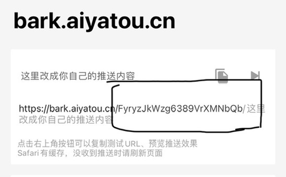

# Bark通知的Halo插件
当有新评论、新文章、等待审核的评论、等待审核的文章时将内容通知通过Bark推送到手机

# 使用方法
安装启用后,左下角会出现新菜单Bark推送,前往设置页面配置完成后即可使用
## 配置项

站点地址 ---对应网站真实地址

-------

Bark服务地址 ---对应部署bark的服务器地址,如没有也可使用bark官方提供的地址:api.day.app

-------

订阅地址  ---为bark对应的user_key,如图

# 支持
> bark地址:https://github.com/Finb/Bark

# 待开发功能
1. 评论回复通知
2. 文章事件优化
3. 推送测试功能